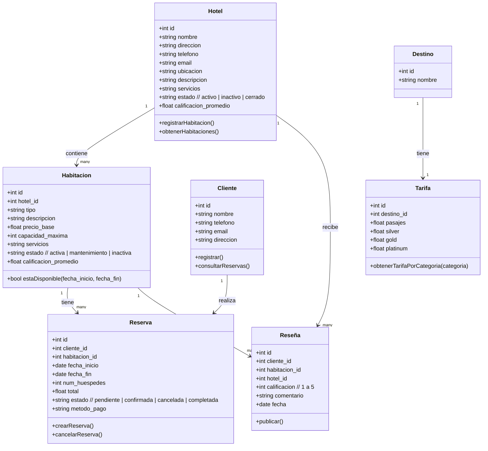

```mermaid
classDiagram
    %% ==============================
    %% Clases principales del sistema
    %% ==============================

    class Hotel {
        +int id
        +string nombre
        +string direccion
        +string telefono
        +string email
        +string ubicacion
        +string descripcion
        +string servicios
        +string estado  // activo | inactivo | cerrado
        +float calificacion_promedio
        +registrarHabitacion()
        +obtenerHabitaciones()
    }

    class Habitacion {
        +int id
        +int hotel_id
        +string tipo
        +string descripcion
        +float precio_base
        +int capacidad_maxima
        +string servicios
        +string estado // activa | mantenimiento | inactiva
        +float calificacion_promedio
        +bool estaDisponible(fecha_inicio, fecha_fin)
    }

    class Cliente {
        +int id
        +string nombre
        +string telefono
        +string email
        +string direccion
        +registrar()
        +consultarReservas()
    }

    class Reserva {
        +int id
        +int cliente_id
        +int habitacion_id
        +date fecha_inicio
        +date fecha_fin
        +int num_huespedes
        +float total
        +string estado // pendiente | confirmada | cancelada | completada
        +string metodo_pago
        +crearReserva()
        +cancelarReserva()
    }

    class Reseña {
        +int id
        +int cliente_id
        +int habitacion_id
        +int hotel_id
        +int calificacion // 1 a 5
        +string comentario
        +date fecha
        +publicar()
    }

    class Destino {
        +int id
        +string nombre
    }

    class Tarifa {
        +int id
        +int destino_id
        +float pasajes
        +float silver
        +float gold
        +float platinum
        +obtenerTarifaPorCategoria(categoria)
    }

    %% ==============================
    %% Relaciones
    %% ==============================

    Hotel "1" --> "many" Habitacion : contiene
    Habitacion "1" --> "many" Reserva : tiene
    Cliente "1" --> "many" Reserva : realiza
    Habitacion "1" --> "many" Reseña : recibe
    Hotel "1" --> "many" Reseña : recibe
    Destino "1" --> "1" Tarifa : tiene
```